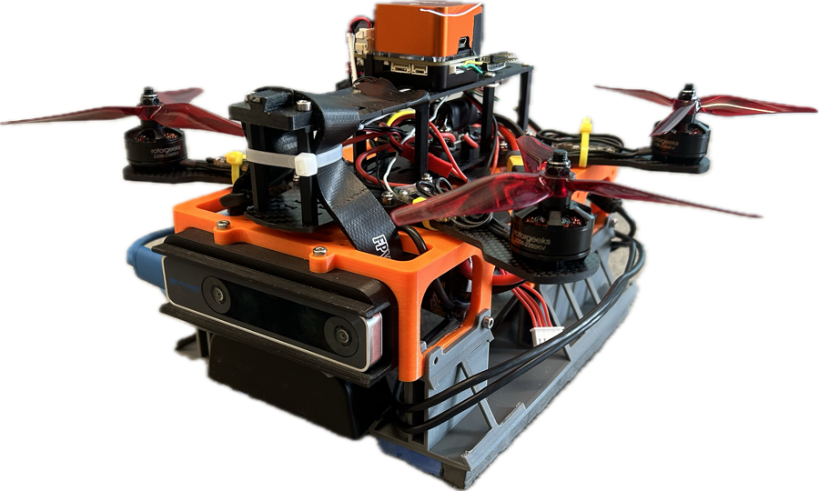
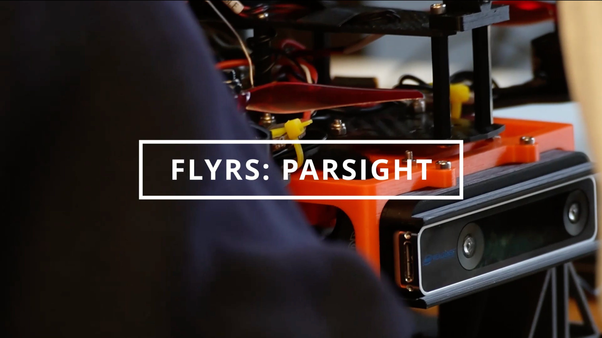

# ParSight - FLyRS [ROB498 Capstone]

This repository showcases our work for ROB498, the Robotics Capstone Design course of Engineering Science (Robotics Engineering) at the University of Toronto. Our team is building a fully functional Micro Aerial Vehicle (MAV) that tackles the Sense-Plan-Act paradigm, alongside complete hardware assembly. From brainstorming and prototyping to testing and integration, this project holistically combines our engineering skills to create a cohesive hardware-software system addressing a real-world robotics challenge. In this repository, you'll find design documentation, code, performance evaluations, and final reports—a hands-on technical journey that brings together everything we've learned.

## Abstract

Golf is an increasingly popular pastime among seniors, offering physical and mental benefits. However, many older golfers report difficulty tracking and locating the ball visually after hitting a shot due to age-related vision decline. Existing ball tracking tools focus on broadcasting graphics and post-game analysis, with no current solutions providing real-time visibility during game play.

ParSight is an autonomous drone-based, real-time golf ball tracking system designed to enhance visibility for senior golfers. The system maintains visual contact with the ball throughout its flight, flies stably, and makes fast, accurate, and robust tracking decisions in real time. To enable fast visual detection using its onboard RGB camera, we use a red golf ball and an HSV-based red filter to enhance red tones while suppressing blue and green channels, followed by added Gaussian blur to reduce image noise. The system uses OpenCV contour detection to identify red regions, scoring them based on size and roundness to select the most likely golf ball candidate. From the selected contour, the center point is extracted and used for tracking, which is performed through Image Based Visual Servoing, where pixel error, the offset between the ball’s position on the screen and the image center, is transformed into a real-world pose correction. ParSight uses a PD controller to determine the drone’s movement, enabling smooth, responsive flight without overshooting. Once the system detects the ball, ParSight autonomously takes off, ascends to tracking height, and locks onto its target ball. When the ball is launched (via a catapult proxy), the drone tracks its flight through rapid acceleration, airtime, bounces, and eventual rolling to a stop. It continues to hover over the ball’s final position, providing constant visual feedback to aid users in locating it.

ParSight achieved a detection accuracy of 95% with only a 3% false positive rate. Although processing latency was just 30 ms, the total system reaction time was approximately 350 ms due to hardware constraints such as camera frame rate and resolution. As a result, the maximum positional error reached 75.51 cm, though the system could still reliably recover and reacquire the ball. These results demonstrated that ParSight met the objectives of the MVP: a working prototype that detects and tracks a golf ball quickly and fairly robustly in real-testing conditions.

The design and implementation of ParSight allowed the team to apply concepts from across their undergraduate journey while navigating the real-world challenges of robotics engineering, such as debugging hardware, tuning control systems, integrating computer vision pipelines, recovering from drone crashes, and collaborating effectively as a team throughout the process.

## Team

We are the FLyRS. From left to right, Felicia Liu, Luke Yang, Rohan Batchu, and Sid Khanna.

## Deliverables

### [Project Proposal](CourseDeliverables/FLyRS_ParSight_Project_Proposal.pdf)
This deliverable served as the foundational step in our project, where we defined the problem, scoped the design, and outlined our approach for solving the golf ball tracking challenge using an unmanned micro aerial vehicle (MAV). The goal was to clearly communicate the design challenge, the motivation behind it, and the proposed solution. We provided a detailed explanation of the design objectives, the critical constraints, and the technical strategy we intend to pursue. This document also sets the stage for the subsequent phases of the project, ensuring alignment with the project's goals and providing a clear framework for evaluation and validation of the final system.

### [Pitch Video](https://youtu.be/EOtyIKrfoxo?si=AKbyNcsjM8_lEWE2)
This video showcases our golf ball tracking drone prototype, demonstrating how it uses computer vision and deep learning to track and locate golf balls in real time. We highlight the key technical features, challenges faced, and how our solution benefits senior golfers and those with mobility issues. The video emphasizes the prototype’s functionality and its potential to improve the golfing experience by providing an intuitive visual aid.

### [Demo Presentation](CourseDeliverables/FLyRS_ParSight_Demo_Presentation.pdf)
This presentation served as the culmination of our design efforts, where we demonstrated a working prototype that addressed the core problem defined in our proposal. The goal was to showcase the key technical features of our system, explain the design process we followed, and justify the major decisions and trade-offs we made along the way. We aimed to convey the value of our solution, highlight the functionality achieved, and provide a clear understanding of how the prototype fulfilled our main objectives.

### [Final Report](CourseDeliverables/FLyRS_ParSight_Final_Report.pdf)
This report serves as the culmination of our design efforts, where we present a comprehensive overview of our project and the results achieved. The goal is to summarize the design process, highlight key decisions and trade-offs, and demonstrate how the final prototype meets the objectives outlined in our proposal. We aim to clearly communicate the value of our solution, the technical features developed, and the challenges faced throughout the process. Through this report, we provide a detailed understxwanding of the design, its functionality, and how it addresses the core problem.
